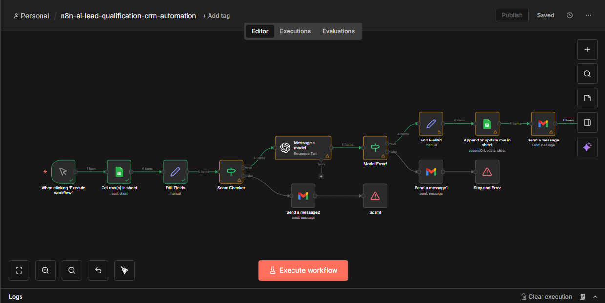

# 🤖 AI-Powered Lead Qualification & CRM Automation (n8n)

This project is a **real-world, end-to-end automation** built using **n8n**, **OpenAI**, **Google Sheets**, and **Gmail**.

The workflow automatically qualifies inbound leads, filters out invalid or scam entries, generates AI-powered follow-up emails, and updates a Google Sheets–based CRM — all with proper validation and error handling.

This is not a demo or It mirrors how agencies and sales teams automate lead handling in production.

---

## 🚀 What This Automation Does

1. Manually triggers the workflow for testing and control
2. Reads raw inbound leads from Google Sheets
3. Normalizes and cleans lead data
4. Filters out invalid or scam leads before AI processing
5. Uses OpenAI to:
   - Classify leads as **Hot / Warm / Cold**
   - Explain the reasoning behind the classification
   - Generate a human-like follow-up email
6. Sends follow-up emails only to valid leads
7. Updates the Google Sheets CRM with AI results
8. Handles OpenAI errors gracefully with admin alerts

---

## 🧠 Key Features

- AI-powered lead qualification
- Scam and invalid lead filtering
- Structured JSON-based AI responses
- Conditional email sending
- CRM updates in Google Sheets
- Error handling and admin notifications
- Clean, readable workflow design

---

## 📊 Google Sheets CRM Structure

The automation expects the following columns:

- Name  
- Email  
- Company  
- Message  
- Source  
- AI Score  
- Lead Type  
- AI Summary  
- Follow-up Message  
- Contacted  

All AI-generated fields are filled automatically by the workflow.

---

## 🧮 Lead Prioritization Logic

All **valid non-scam leads are treated with equal importance**.

Instead of numeric scoring, leads are categorized into:
- **Hot** → urgent and high intent
- **Warm** → interest shown, lower urgency
- **Cold** → exploratory or vague intent

This design decision keeps the workflow simple, fair, and aligned with real operational needs.

---

## 🛠 Tools Used (All Free / Allowed)

- **n8n** – automation engine  
- **Google Sheets** – CRM and data storage  
- **Gmail** – automated follow-up emails  
- **OpenAI API** – lead analysis and email generation  

❌ No paid third-party tools  
❌ No webhooks  
❌ No HTTP request nodes  

---

## 📸 Workflow Screenshot

Below is a screenshot of the complete automation workflow:

---

## 📂 Repository Files

- `My workflow (2).json` → Full n8n workflow export
- `image.png` → Visual proof of the automation

---

## ⚠️ Error Handling & Validation

- Invalid or scam leads are stopped early
- OpenAI failures trigger admin email alerts
- Leads are matched and updated using **Email** to avoid duplicates
- Already-contacted leads are not reprocessed

---

## 🎯 Why This Project Matters

This automation demonstrates:
- Real business logic
- AI + automation integration
- CRM-style workflows
- Production-safe decision-making
- Clear separation of concerns

It reflects how professional automation systems are actually built and maintained.

---

## 🔮 Future Improvements

- Scheduled or webhook-based triggers
- Multi-client CRM support
- AI confidence scoring
- Slack or Discord notifications
- Web dashboard integration

---

## 👤 Author

Built by **Hassan Rizwan** as part of an advanced n8n learning journey.

GitHub Profile: https://github.com/hassanrizwan247
